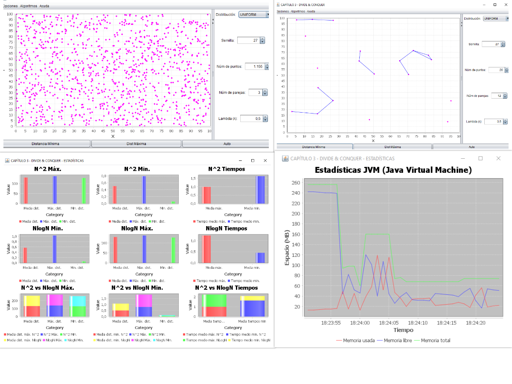

# Algoritmos avanzados

## Estructura del repositorio

El repositorio está organizado de la siguiente manera:

```bash
.
├── 1_general_concepts/  # Capítulo 1: Conceptos generales
├── 2_backtracking/      # Capítulo 2: Backtracking
├── 3_dandq/             # Capítulo 3: Divide y vencerás
└── Templates/           # Plantillas para las prácticas
```

## Prácticas

### Práctica 1: Conceptos generales

Ver más en [Conceptos generales](./1_general_concepts/README.md).


### Práctica 2: Backtracking

Ver más en [Backtracking](./2_backtracking/README.md).


### Práctica 3: Divide y vencerás

Ver más en [Divide y vencerás](./3_dandq/README.md).


