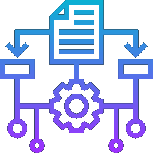

<p align="center">
    
</p>

<h3 align="center">Algoritmos Avanzados</h3>

<div align="center">

</div>

---

<p align="center">Proyectos usando la arquitectura MVC</p>

## ⚙️ Proyectos

- [Conceptos generales](./1_general_concepts/)
- [Backtracking](./2_backtracking/)
- [Divide & Conquer](./3_DANDQ/)
- [Greedy algorithms](./4_greedy/)
- [Programación Dinámica](./5_dynamic/)
- [Branch & Bound](./6_BandB/)
- [Primalidad y encriptación](./7_probabilistic/)

## 📝 Estructura del repositorio

El repositorio está organizado de la siguiente manera:

```bash
.
├── 1_general_concepts/  # Capítulo 1: Conceptos generales
├── 2_backtracking/      # Capítulo 2: Backtracking
├── 3_dandq/             # Capítulo 3: Divide y vencerás
.
.
.
├── 7_probabilistic/     # Capítulo 7: Primalidad y encriptación
└── templates/           # Plantillas para las prácticas
```

## 🧠 Motivación

Para la asignatura de Algoritmos avanzados en la [Universidad de las Islas Baleares](https://www.uib.es/es/) se piden un conjunto de proyectos usando el patrón de diseño [MVC](https://developer.mozilla.org/es/docs/Glossary/MVC). A lo largo del desarrollo de la asignatura, se fueron añadiendo funcionalidades adicionales, como podría ser:

- Un sistema de peticiones para la comunicación entre módulos, como [node.js](https://nodejs.org/es)
- La implementación de una base de datos local para guardar los resultados

Este repositiorio tiene como objetivo inspirar a los siguientes alumnos que hagan esta asignatura a superar los límites impuestos por los profesores y explorar diferentes aspectos de la programación que posiblemente no se enseñen en la carrera.

Adicionalmente, la documentación esta totalmente escrita en [LaTeX](https://www.latex-project.org/) y su código fuente está disponible para la exploración del interesado.

> Para el desarollo de la documentación se usó [Overleaf](https://www.overleaf.com/)
